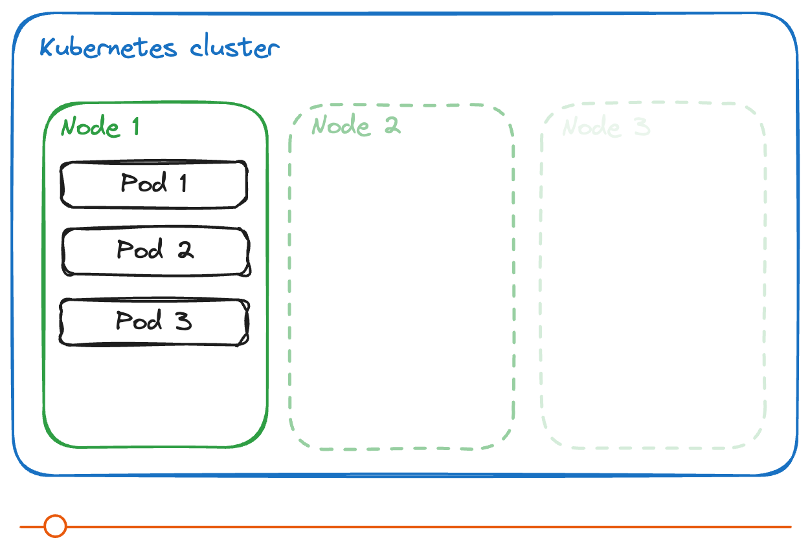
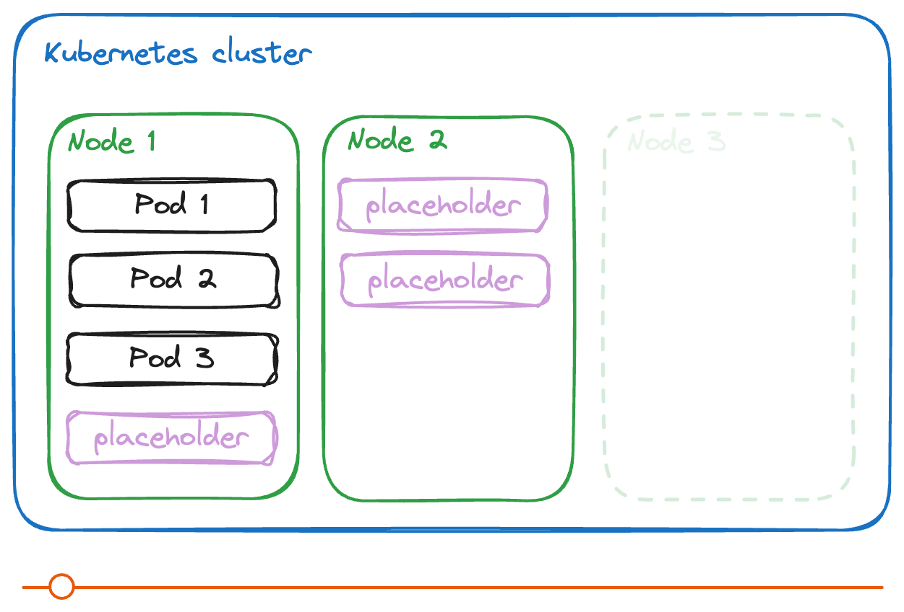

+++
title = 'Kubernetes, proactive autoscaling using placeholder (or balloon 🎈) Pods'
date = 2024-07-17T11:48:20+02:00
draft = false
tags = ['autoscaling', 'priorityClass', 'placeholder', 'balloon']
categories = ['kubernetes']
summary = """\
    Kubernetes is a very practical container orchestrator.
    However, in some cases, we need to proactively provision cluster nodes to take on load quickly.
    In this article, you'll learn how to use balloon pods or placeholder pods to pre-provision your nodes.\
    """
+++

## Context

The __node__ family ([`t2d-standard-1`](https://cloud.google.com/compute/docs/general-purpose-machines#t2d_machine_types)) used is configured with:
* Memory: 4GB
* vCPU: 1

## Architecture concept

### Without the placeholder/balloon technique

As you can see from this animation. 
The problem we encounter is mainly the arrival of the new node (`Node 2` and `Node 3`).  
In short, when a node is fully occupied (`Node 1`), a new node is created (`Node 2` and `Node 3`), accepting new pods only when their scale requires it (`Pod 5` and `Pod 6`).

### With the placeholder/balloon technique

In our case, we use placeholders or balloons to prepare for the arrival of new pods.  
In this way, we ensure that we can accommodate them.

The placeholder pods will ensure that there is sufficient availability for the load of the others pods.

The priority of work pods will take precedence over that of placeholder pods.

To do this, we use two Kubernetes [`PriorityClass`](https://kubernetes.io/docs/concepts/scheduling-eviction/pod-priority-preemption/) resources.

## Implementation

### Creation of priority class resources

To implement this solution, we need to create two [`PriorityClass`] resources (https://kubernetes.io/docs/concepts/scheduling-eviction/pod-priority-preemption/).

The first will control placeholder/balloon pods.


---
apiVersion: scheduling.k8s.io/v1
kind: PriorityClass
metadata:
  name: placeholder-priority
value: -10
preemptionPolicy: Never
globalDefault: false
description: "Low priority."


[Read more](https://cloud.google.com/kubernetes-engine/docs/how-to/capacity-provisioning#create-priorityclass) about the the field set to `-10` in [Google Kubernetes Engine (GKE) autopilot](https://cloud.google.com/kubernetes-engine/docs/concepts/autopilot-overview) context usage.

[Read more](https://kubernetes.io/docs/concepts/scheduling-eviction/pod-priority-preemption/#non-preempting-priority-class) about the field `preemptionPolicy` to `Never`.
In our case, the `globalDefault` field is disabled.

---

The second will be used for classic default global workload pods.


---
apiVersion: scheduling.k8s.io/v1
kind: PriorityClass
metadata:
  name: default-priority
value: 0
preemptionPolicy: PreemptLowerPriority
globalDefault: true
description: "Global default priority."


### Example of workload

When you want to deploy your workloads, you can do it this way.

As you can see, we explicitly pass the `default-priority` value for the `priorityClassName` field.

In this way, these workloads take precedence over placeholders/balloons, and will replace them when needed.


---
apiVersion: apps/v1
kind: Deployment
metadata:
  name: placeholder
spec:
  replicas: 3
  selector:
    matchLabels:
      pod: placeholder-pod
  template:
    metadata:
      labels:
        pod: placeholder-pod
    spec:
      priorityClassName: placeholder-priority
      terminationGracePeriodSeconds: 0
      containers:
      - name: ubuntu
        image: ubuntu
        command: ["sleep"]
        args: ["infinity"]
        resources:
          limits:
            cpu: 250m
            ephemeral-storage: 1Gi
            memory: 950M
          requests:
            cpu: 250m
            ephemeral-storage: 1Gi
            memory: 950M


[Read more](https://kubernetes.io/docs/concepts/scheduling-eviction/pod-priority-preemption/#non-preempting-priority-class) about field `preemptionPolicy` to `PreemptLowerPriority`.

### Creation of placeholder/balloon deployment resources

Here's how we'll configure the deployment to have 3 placeholders.

The most important part here is the `priorityClassName` field, configured with the `placeholder-priority` value from our `PriorityClass` resource seen earlier.


---
apiVersion: apps/v1
kind: Deployment
metadata:
  name: nginx
spec:
  replicas: 3
  selector:
    matchLabels:
      pod: nginx-pod
  template:
    metadata:
      labels:
        pod: nginx-pod
    spec:
      priorityClassName: default-priority
      containers:
      - name: nginx
        image: nginx
        resources:
          limits:
            cpu: 250m
            ephemeral-storage: 1Gi
            memory: 950M
          requests:
            cpu: 250m
            ephemeral-storage: 1Gi
            memory: 950M


Note the importance of always __always__ defining the requests and limits of your resources.

## Conclusion

As you can see, this system is very simple to set up.  
The advantage is that you can use this system in managed solutions such as [Google Kubernetes Engine (GKE)](https://cloud.google.com/kubernetes-engine/docs/concepts/autopilot-overview) in Autopilot operating mode when you're not managing nodes.
